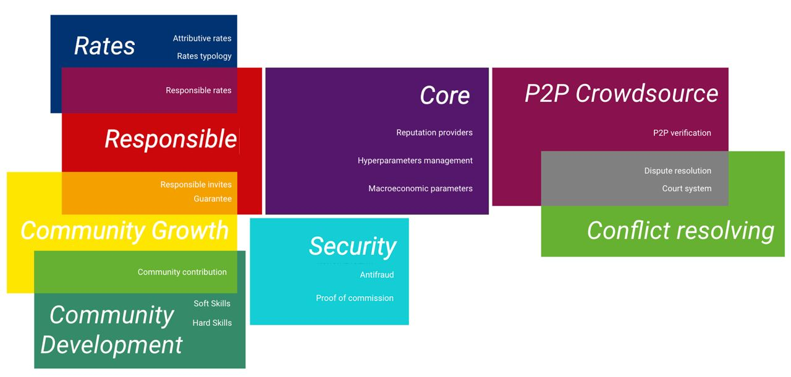

# Reputation systems

Based on in-depth extensive market research, we develop protocols, create tools, solutions and libraries for work processes organization to be used by related DAOs, communities, and companies. We develop and work out in detail high-standard protocols and support our protocol solutions with an implementation for EVM-compatible blockchains on smart contracts in Solidity.

The core idea behind our solutions is the reputation system.

**Reputation system** - System of highly configurable reputation system as a core and different services that relies on it.

On top of this we are in process of designing the following additional systems:

**Web3 token access** - Availability of different features depending on the user's reputation rating*

**Voting** - System of different types of voting using agent modeling and voting to satisfy community members and perform community development by creating a library of solutions for voting.

**Booking** - Booking system for various purposes, using different payment systems and for particular cases.

## General overview of our rep system

WorkFi Tools are open source solutions to boost the WorkFi industry,
from decentralized freelance platforms to tools for complicated business processes.
This proposal focuses on one key subsystem of the WorkFi: the reputation system for counterparts.
It can also be suitable for a wide variety of other applications like decentralized Uber-like DAOs or marketplaces.
The implementation is supposed to be a set of smart-contracts for EVM-compatible blockchains like Moonbeam and others.

Our team is eager to both create Open Source solutions (which are the subject of this proposal)
and build commercial projects on top of them (which defines our long-term interest in maintaining the project).

### Project Details

**Guarantee** - Guarantee of the fact that the invited user fulfills his obligations. This part affects both: the inviter's rating
as well as the invited user's rating.

**Responsible invites** - Responsible attitude towards who a person invites to use the platform. The invitation can be withdrawn if the invited
users do not fulfill their obligations. This part affects the inviter's rating as well.

**Responsible rates** - Responsible attitude to how the user rates input of other members of the community, understanding the consequences
of his ratings for users and for his own rating level.

**Attributive rates** - Changes in reputation indicators depending on the user's competencies (software, hard skills, area of knowledge and work).

**Rates typology** - Relevant options for categorizing the most appropriate ways to rate users in certain cases.

**Soft Skills (Community Development)** - System of protocols for giving feedback to community users according to their soft skills in the most appropriate and efficient way.

**Hard Skills (Community Development)** - System of protocols for giving feedback to community users according to their hard skills in the most appropriate and efficient way.

**Community contribution** - Community development system, which includes ways to motivate and increase the level of user involvement
and contribution to the community.

**Proof of commission** - Algorithm for verifying user actions, including resistance to scam and fraudulent actions.

**Anti fraud** - Analysis and evaluation of use cases in which users can fraudulently raise their reputation, create bots;
solution development towards what changes should be implemented in the protocol to prevent such actions.

**Reputation providers** - Interaction of a service (platform) and several reputation providers, as well as ways to aggregate information using data from several reputation providers.

**Macroeconomic parameters** - Macroeconomic regulation of reputation indicators and ways of changing reputation indicators depending on internal
economic trends within services.

**Hypermarameters management** - The relationship between changes in the rating of one user and the impact of these changes on the ratings
of other users - depending on the interaction between these particular users; as well as different options for motivating and managing reputation indicators within services

**P2P verification** - System to determine which operations can be delegated for verification by the community itself
(KYC, diploma, level of knowledge, subjective assessment and rating).

**Dispute resolution** - System of involving qualified competent users to disputable cases in order to resolve conflict situations
(appeal, dispute, controversial cases).

**Court system** - A more complex and expensive conflict resolution system for serious situations - inspired by classical law. The main focus is on the values of the community.

### Tech stack

Tech stack that we are going to use is somewhat standard (with minor choices to be made in the process):
Solidity for EVM smart-contracts, some parts of OpenZeppelin, Hardhat + Moralis for quicker development,
Frontier for compatibility with Polkadot parachains, Node.js/TypeScript/TypeChain/Mocha/Chai/Jest forautotesting,
Solhint/Prettier/Husky/ESLint for good code style, presumably Laika, solidity-docgen and some other infrastructure tools.

### Principles

The reputation system is a configurable set of principles and rules embodied in a system of smart contracts written in the Solidity language.

Reputation system is designed for use in systems, services, DAOs and communities, in which participants can give each other marks for some interactions - both paid (performance of works, consultations) and unpaid. Proof of commission is applicable only for paid interactions.

Here are some of core principles:

1. Proof of Commission (antiscam)
2. Responsibility (for grates, invites, etc)
3. Rates should be attributive
4. To crowdsource as much as possible (work, information, or opinions) from community
5. True ownership and service agnostic
6. Scam Resistance
7. Reputation sustainability (f.e. handling of abnormally bad grades)

#### The Macroeconomics of Reputation

##### Usecases

**P2P Guarantor** – a community member with a sufficiently high reputation who can guarantee the quality of interactions with another community member - new or with little reputation - in exchange for a share of the profits.

Guarantor is responsible by its reputation for the assignee for the entire term of the guarantee given. In case the guarantor receives low grades, it decreases the reputation of the guarantor. In case of positive evaluations it increases. The rate of increase and decrease of the reputation of the guarantor is regulated by the set coefficients and is one of the tools for tuning the reputation macroeconomics.

**Main scenario** – solve the problem when a new member of the community has no reputation at all and because of this it can be very difficult for him to get the first orders and prove himself

**Side Scenarios**

1. The outstaff team manager vouches for the quality of all team members
2. A top-notch renowned expert audits the performer's competencies and vouches for him in the event of a successful test
3. Course instructor vouches for his students - performers on the platform, and helps them in case of problems to successfully perform tasks
4. Professional guarantors are community members who are good at identifying qualifications and predicting the quality of services provided by the performer. Possibly help with the most difficult cases to avoid negative evaluations.

**How it works**

Let's take the basic scenario as an example.

**Background**. There is some community S with a reputation system R, in which scientific experts advise each other for a fee. There is a respected member of the community with a high reputation (20K) named A. There is a new member of the community, B, who is also a high-level expert, but has just registered on the platform and his reputation is 0. A and B know each other well.

1. B asks A to act as his guarantor, and A agrees.
2. A with the UI calls the method in R: R.guarantee()

##### Features

###### Attributive rates

The reputation of the performer grows in the industry in which he performs the contract. If you do design, your reputation in design grows, dev grows your reputation in dev, and so on. One performer can have several skills and accordingly several reputations.

There should also be a separate, unified reputation of the customer. Conventionally, as it is implemented in taxi services, where the driver evaluates the passenger. The higher the reputation of the passenger, the better driver will come to him.

Motivations for giving grades can be divided into two notional groups: positive and negative.

**Positive**:

1. If the user puts a rating/writes a comment his reputation grows more than 100%.
2. Explanatory material that tells the importance of each grade.
3. Game mechanics. Achievement of certain levels, special achifks in the form of NFTs. As an example, consider DuoLingvo.
4. The more reviews and orders you make in a month, the lower the commission. Each month, the lower the commission begins again.
5. A scale like in P2P binance that shows completed transactions and % of reviews written/written. Could be an additional factor when choosing a customer/executor.
6. Users see reviews that previous users have left and can like them. If your review helped, you get extra reputation. The more likes the post has, the higher it is worth.
7. A reminder in your personal account or by email. "You didn't leave a review for Ilon Musk, please do, it's very important for Ilon.
8. If the performer has no reviews/ratings then the first one who put gets more reputation. A system that automatically monitors parameters and tunes them.

**Negative**:

1. As long as the performer hasn't put a grade/written a review to the customer, the performer doesn't get any money.
2. You get less reputation without a review or evaluation.
3. You can only make a certain number of deals without rating/writing a review. If you exceed this number, you are quarantined for some time.

**Cross-Service Reputation** can be implemented like ratings for movies. It is conditionally possible to load reputation from other services and show it as a widget.

For some services, you might consider a grading system in the form of smiley faces. As an example of a reaction on FB.

**Macro parameters:**

e
	TODO: 1. Новые отзывы / оценки, 2. ..reputation diminishing with time (meritocracy vs aristocracy)

### Basic reputation representation model and unification problems

	TODO: ???

## Reputation model

**Main Terms**

The system consists of agents A1, A2, ..., who interact via transactions T1, T2, ...

Agent An can initiate an interaction with agent Am.

The interaction can be unidirectional (asymmetric) or bidirectional (symmetric). *todo: what’s the difference?*

*In some systems (watch a video and rate it with likes - no consent of both parties to interact is required, in others like Upwork - it is required)*

Each agent `An` has a function - estimate the result of the interaction `RateSubjectiveN(T1(An, Am)) -> RateNM`.

*In the case of symmetric interaction, two estimates are made:*

`RateSubjectiveN(T1(An, Am)) -> RateNM`

`RateSubjectiveM(T1(An, Am)) -> RateMN`

Each agent `A1`, `A2`, ... corresponds to `RateObj1`, `RateObj2`, ..., which integrates results of interactions directed to `A1`, `A2`, ...

There is a function that updates `RateObj` for `A` based on the results of the `T` interaction:

`RateUpdate(RateObj_M, RateMN) -> RateObj_M_updated`

**Why a reputation system is needed**

The main purpose of the reputation system is to give the most accurate prediction of the results of interactions between agents.

There is a system of `Com` interacting agents `A1`, `A2`, ...

Each agent has a regularly changing indicator of satisfaction - Contentment. As a result of the interaction at least one of the parties changes this indicator.

The quality of the Com system depends on the total increase in satisfaction ∫ (∑(Contentment_i, i, 1...n), (t, 0, Com_lifetime), dt) over the lifetime of the system.

The more agents the better.

The more interactions between them, the better.

The longer the system lives, the better.

**The higher the increase in satisfaction with the results of each of the interactions, the better**

In the general

`Interaction(A1, A2, context1, context2) ->`

`UpdateContentment1(Cont1) -> Cont1_updated,`

`UpdateContentment2(Cont2) -> Cont2_updated,`

Interactions can be context-free, containing one or two contexts.

Context `Cont_n` of the `Tmn` agent `An` interaction - special conditions for the `Tmn` interaction. For example, the text of the task.

Examples of two-context interaction:

1. a complex transaction where each party does something for the other party. For example, a service for a service
2. the acquaintance of two people; the contexts in this case are who each of the couple would like to meet

For different contexts, the result of interaction between the same agents may be different.

In order to optimize aggregate satisfaction, it is necessary to:

1. maximize the number of interactions that increase satisfaction
2. select for interactions such agents (given the current contexts), for which the total increase in satisfaction will be maximum
3. Avoid interactions that will result in lower overall satisfaction

In order to choose the interactions for which the increase in satisfaction will be maximal, it is necessary to predict the satisfaction of the agents.

`PredictContentments(A1, A2, Context1, Context2) ->`

`-> (∂Contentment1, ∂Contentment2)`

## WorkFi industry

### WorkFi.tools mission

Our mission is to deliver open-source protocols, tools, and solutions, that will:

- accelerate the development of the WorkFi industry;
- be useful in community/DAO-related startups;
- make web3 products and services easier to implement.

### WorkFi vision

Due to the fact that workflows are now being actively built in a remote format, the demand for organizing online interaction between people is growing. The issue of organizing work in companies, among individual entrepreneurs and freelancers is raised more and more often nowadays. In this way, a whole WorkFi industry emerges. 

This industry is at the very beginning of its development, and with our initiatives, solutions, and technical support, we want this direction to thrive and expand further.

We develop thoroughly detailed open source solutions and create convenient tools which can be implemented into process organization workflows, DAO and community-related projects to be actively used by associated companies, communities and teams. Our solutions have the potential to boost the entire industry and define its boundaries. 

We see such a direction of development coming to life with a well-documented protocol-first approach, diverse use cases, scenarios, and usage patterns, where solutions and supporting tools, which we create, are used as a basis for further usage and customized development by other companies and teams.

### Multiple rep providers

	YAKOV 100% made something, maybe in Miro? Or somwhere in Notion

## WorkFi Roadmap

	6 months, 2 years (vision) TODO🔥

# Market overview

## Web 2

The following is the analysis of existing web2 projects and services managing reputation and p2p communication.

### Habr

#### Карма

[https://habr.com/ru/docs/help/karma/](https://habr.com/ru/docs/help/karma/)

Карма - это инструмент саморегуляции в комьюнити. 

> … даже написав сотню полезных публикаций … и достигнув показателя кармы в +100500 единиц, можно потерять их все, … разместив лишь один неуместный комментарий.
> 

❗Примечательно, что пользователь не может ставить другим участникам отрицательную карму, пока сам не наберет 5 очков. Т.о. новички в системе не могут минусить авторов.

➕ По достижению 50 очков кармы, пользователю дается право наделить чужой аккаунт статусом “полноправный” (расширяет полномочия). Т.о. пользователь А, набрав 50 очков, может сказать, что пользователь Б может “размещать материалы сразу на сайте, без предварительной проверки модераторами”

➖Отрицательная карма приводит к замедлению активности пользователя. Пользователь с кармой [-5; -1] может публиковать 1 коммент за 5 минут. Пользователь с [-30; -11] – раз в день. Высшая мера наказания - перевод в режим ReadOnly.

🧮 1 единица кармы = 1 голос в сутки, который можно отдать за карму или публикацию, либо 2 голоса за комментарии

На хабре существуют система грейдов. Голоса разных пользователей имеют разный вес: 

> … «Автор», «Старожил» и «Звезда», в случае положительной оценки публикации, добавляют ей +2 пункта рейтинга. А обладатели значка «Легенда» одним голосом добавляют публикации сразу +3 пункта рейтинга.
> 

> не применяется при голосовании в минус
> 

❗Пользователь А может голосовать за карму пользователя В только 1 раз. При этом, он может поменять решение. 
Кейс (проверил на себе 🙂): у пользователя А карма = 10. Пользователь В может сделать карму = 11 (добавить 1). Затем передумать и сделать карму = 9 (-1 от изначального). Потом передумать снова и сделать все же 11 (+1 от изначального). 
Но никак не может довести карму до 8 (-2) или 12 (+2)  

0️⃣ Один раз, за все время, пользователь может обнулить свою карму. Это может потребоваться, если карма пользователя ушла в глубокий минус. Действительно, очень трудно восстановить карму, если ты в режиме readonly и не можешь ничего писать/комментировать…
Те, кто голосовали ранее за карму данного пользователя, снова могут голосовать за его карму (в + и в -)

#### Рейтинг

> По сути, рейтинг это параметр, отражающий интерес сообщества к деятельности пользователя на ресурсе.
> 

Рейтинг – это сумма лайков, к постам и комментариям пользователя. 

Примечательно, что рейтинг может “остывать”: с течением времени, он стремится к нулю. Т.о. в топ хабра попадают наиболее активные участники сообщества – люди, которые регулярно публикуют [годные] посты и комментарии. 

#### RecoveryMode

Это режим, в который попадает пользователь с кармой [-30; -11].

В этом режиме, пользователь может писать 1 пост в неделю – последний шанс насобирать карму и вылезти из “ямы”.

### Yandex

#### Рейтинг

Рейтинг = средневзвешенное последних 150 оценок пользователей: чем «свежее» оценка, тем больший у неё вес. 

❗Значит, низкую оценку можно “протолкнуть” в конец, выполняя больше заказов.

#### Приоритет

Этот механизм позволяет определять исполнителя заказа. У кого выше приоритет, тому и предлагается заказ. 

Нам это не очень полезно, но могут быть интересные механики.

#### Активность

Баллы Активности начисляются за каждый выполненный заказ. И снимаются, пропуск или отмену заказа. Если Активность упадёт слишком низко, заказы перестанут поступать. 

> Чем дальше находится пассажир или отправитель, тем больше баллов вы получите за принятый заказ. И тем меньше снимется за пропуск.

### Elo

Система,  используется для расчета очков в играх на 2х участников. Самое известное применение – шахматы.

Идея: если игрок с малым рейтингом выигрывает у более сильного игрока, слабому начисляется много очков. Если сильный игрок выигрывает у слабого, сильный получает мало очков.

Переводим на репутацию: если участник с малым рейтингом помогает участнику с большим рейтингом, то получает больше очков. Если участник с большим рейтингом помогает “новичку”, получает немного очков. Оплата производится в любом случае.

Также, участник с высоким рейтингом помогает другому участнику с высоким рейтингом – относительно невысокий рост рейтинга.

### Профи.ру

Информации на сайте нет.

Зато есть куча инструкций, как поднять рейтинг на сайте. В основном, все сводится к накрутке через агентства ([https://100review.ru](https://100review.ru/))

### AirBnB

Объекта размещения оценивается по категориям + общая оценка.

Гость может поставить 5 за чистоту, уют и расположение и, при этом, поставить общую оценку 2.

#### Запрашивать подтверждение (обращать внимание на нелогичность оценки)

Сервис переспрашивает пользователя, если итоговая оценка ниже средней за критерии. В сценарии выше, сервис должен показать предупреждение, что итоговая оценка ниже оценок по категориям. 

> … повысились общие оценки, которые гости ставят хозяевам. … число 3-звездочных отзывов снизилось на 2,8%, а 2-зведочных — на 3,9%. Хотя эти цифры могут показаться незначительными, они заметно влияют на точность системы отзывов, и хозяева от этого выигрывают.
> 

#### Уточнять, почему именно низкая оценка.

На примере оценки местоположения.

Хозяин жилья не может повлиять на размещение объекта. Оценка размещения субективна. Одному нравится, кто дом на окраине, другому – нет, потому что далеко до исторического центра.

> Если гость ставит за расположение жилья меньше 3 звезд, отображается вопрос: «Местоположение жилья описано неточно?» Благодаря этому оценки по данной категории повысились в среднем на 0,8%.
> 

Т.о., когда клиент хочет поставить низкую оценку, сервис уточняет, действительно ли объект *заслужил* такую оценку.

## Web 3

### Your Justice

- Web: https://www.yourjustice.life, https://yj.life
- Github: https://github.com/YourJustice-Live/
- Stage: Alpha
- Networks: Poligon (testnet), BSC (testnet)
- Substrate/Polkadot/Kusama ecosystem availability: may work on EVM parachains (not targeting them)
#### Description

Open-source platform for reputation and near-legal relationships within communities. 

### Colony
TODO

- Web: https://colony.io
- Whitepaper: https://colony.io/whitepaper.pdf (reputation: chapter 5)
- Github: https://github.com/joincolony

### Aragon Court & Aragon Govern platform review

- Web: https://court.aragon.org, https://govern.aragon.org
- Github: https://github.com/aragon/govern, https://github.com/aragon/aragon-court, ...
- Networks: Eth (and Rinkeby), Polygon (and Mumbai), Harmony, BSC, Stardust
- Substrate/Polkadot/Kusama ecosystem availability: may work on EVM parachains (not targeting them)
TODO

### Kleros Platform Overview

- Web: https://kleros.io
- GitHub: https://github.com/kleros
- Stage: Kleros 2.0
- Network: ETH
- Substrate/Polkadot/Kusama ecosystem availability: may work on EVM parachains (not targeting them)
TODO
#### Our differences

- Kleros' value proposition is decentralized arbitration for dispute resolving;
  our vision is a more general as we consider dispute resolution a part of reputation system.
  A solution like Kleros might be used as a submodule of our system.

### DREP Overview

- Web: https://www.drep.org , https://medium.com/drep-family
- Github: https://github.com/drep-project
- Stage: is not actively maintained - last commit was in 2021
- News: https://t.me/drep_foundation_announcements

#### Description

From the main page:

> Drep is committed to building a "connector" and "toolbox" based on blockchain technology, providing solutions with ease of use, flexibility and no impact.
> 
> Based on drep underlying public chain, drep decentralized ID system, drep reputation protocol layer and drep SDK, we can build an open data ecology on the chain and break the current situation of separation of public chain ecology.

From [docs](https://docs.drep.org/technology-advantages/reputation/):

DREP Reputation System is a comprehensive close-loop ecosystem which includes a general reputation protocol, reputation pipeline interface, reputation on-chain data storage and algorithm library, reputation reward system, reputation value account management and fake account identification mechanisms. In the ecosystem, users’ behavior is linked to their reputation which will be evaluated by multiple interacting parties. Users will also receive complete real-time updates on their reputation.

### Ontology

- Web: https://ont.io/
- Github: https://github.com/ontio
- Stage: in production

#### Description

Ontology implements a series of blockchain based protocols, including Orange - a Reputation Protocol (a community-driven project). 

Mission, as on the main page: Bringing trust, privacy, and security to Web3 through decentralized identity and data solutions.

Ontology has a trust search engine which provides authentication and connects services for individuals. 

> At Ontology, we envision a future where your identity and data are protected through encryption. Your on and off-chain data are secured without stress or worry. With **ONT ID**, you can protect your identity and data without constant oversight or maintenance. Using ONT ID prevents malicious actors from hijacking your identity or accessing personal information. We're building a future that guarantees you total control over who can access, see, and use your online data and identity.

### Orange protocol

- Web: https://www.orangeprotocol.io
- GitHub: https://github.com/orange-protocol
- Substrate/Polkadot/Kusama ecosystem availability: may work on EVM parachains (not targeting them)
- Networks: Ethereum, Polygon, BSC

#### Orange protocol description

From [overview](https://docs.orangeprotocol.io/overview):

> On-chain data is currently scattered across a myriad of decentralized applications. Many types of actions take place in the form of transactions associated with wallet addresses.
> 
> However, if we were to take that transaction data, extract and consolidate useful data points together turning them into well-defined schemas, this data can prove to be very useful in assessing an entity's on-chain identity for specific contexts. Orange is to achieve just that.
> 
> Orange is a reputation and trust minting protocol that aggregates data and Web3 reputation models to generate comprehensive reputation proofs in the form of Verifiable Credentials and NFTs.

#### Our differences

- Orange doesn't provide means to create reputation (via voting or other means),
  it only helps with aggregating on-chain data to interpret facts and behavior as reputation aspects.
  While theoretically this can be used for WorkFi, this makes each service that reads or modifies one's reputation
  to reinvent the wheel. We believe that ready-to-use reputation aspects and procedures for their modification
  will be much more helpful for the industry

### UTU

- Web: https://utu.io
- GitHub: https://github.com/utu-protocol
- Stage: in development (updated whitepaper Aug 10, 2022). MVP: http://defi-portal.utu.io/
- Networks: Ethereum, bridged to BSC, will be bridged to Polygon, and to other chains
- Substrate/Polkadot/Kusama ecosystem availability: may work on EVM parachains (not targeting them)

#### Description

From main page:

> UTU’s mission is to become the trust infrastructure of the entire internet, replacing anonymous star ratings, reviews, and scores as the de facto trust mechanisms of our digital lives.

From UTU Protocol Whitepaper V4:

> UTU was born to help people take these five actions: Connect, Send, Swap, Stake, & Borrow. We have removed most of the clutter about Web 2 use cases and reframed UTU around the core problems it solves for:
> - Connect: Is this Dapp going to drain my wallet?
> - Send: Is this the right address? Do I need to do a test transaction?
> - Swap: Is the real token? Should I really buy this?
> - Stake: Will I get my funds back? And the promised yield?
> - Borrow: Is the borrower going to pay back?

From the protocol page:

> How the UTU Protocol Works:
> - You should earn from the reviews you create and the data you share. UTU pays you for creating trustworthy reviews and ratings and for sharing your data with apps that you use.
> - Fake and inaccurate reviews can lead to poor purchase decisions. The UTU protocol leverages blockchain to ensure that reviews can’t be manipulated.
> - Big tech companies capture and use your data without you even knowing it. With UTU, you have full control over the data you share.

UTU uses an own fungible, non-transferable token (UTU Trust Token) for reputation count.

#### Our differences

- UTU focuses on providing 'trust' which is an important aspect of reputation but not enough for WorkFi
  as it doesn't tell anything about the skills/quality of previous work;
  other aspects like contribution to community should also be supported by a reputation system;
- another UTU's focus is privacy: whitepaper says "we want users to be able to fully control
  who gets to access their data when, for what reason, in what context etc".
  We, on the other hand, envision reputation as something publicly available (transparent),
  any person or service should have read access to it (and reputation flaws should not be hidden)

# Responsibility

Responsibility is a principle that we use in the design of some modules. We need it so that users are responsible for their actions. This way we motivate them to make better (quality) decisions. We design responsible rates and responsible invites. These mechanisms should increase the overall level of the system.

## Responsible rates 

	TODO🔥

Scores that go against the community result in a loss.

## Responsible invites (vouching)

Once a user reaches the reputation threshold, he receives an invite. This invite can be used to invite a new user to the network.

The invited user, on start, gets a percentage of the reputation of the inviting user. This is to reflect that probably the better your referrer is, the better you are. Invited user profile shows their inviter. This way, the system indicates WHO is behind the new community member.

Referrals can both help or hurt the inviting user: if the invitee recommends themselves as a trustworthy member of the community, they get reputation increase, and the inviter gets a proportional amount of that reputation for themselves; vice versa, reputation loss is propagated as well.

## Guarantors

	todo: review, translate

# Reputation sustainability

## Handling abnormal scores

### A client is offended by life and gives the worker a minimal rate. Dispute is not open.

If the worker receives a low score, it is quarantined. This is a mode of the score in which it is not displayed and is not accounted in the worker's overall rating (displayed by UI).

If the next 5 scores are higher than the average reputation of the user, the “bad” score is discarded – implying that participants "did not match".

If a score *lower than the average* (?) comes among the next 5 scores, the low score gets accounted. In this case (*in both cases?*), the abnormal score can be disputed.

**The problem being solved** is “spoiling” one’s rating due to miscommunication.

**An adjacent case**: a user with low rating (a not-so-decent community member) gets an abnormally high score (is that a favor or a real improvement?). It also gets quarantined and is applied if the next scores “confirm” it. Note: a dispute is unlikely in this case as both sides are not interested in it.

**Procedure details**

User A has a high rating: their scores are usually in the range 90-100 (with 100 being maximum).

UserB, based on his work/political/religious/personal considerations, gives UserA a score of 10%.

Since the average grade for A = 100+90 / 2 = 95%, the threshold for an acceptable grade would be 42%.

Since 10<42, we believe that the estimate is abnormal. We mark it as suspicious .

Start observing the 5 subsequent evaluations. If the subsequent scores are higher than (100+90-10) / 3 = 60%, consider that the low score was abnormal - discard it from the history and remove the user from quarantine.

In this case, the threshold of the acceptable score has increased - an additional incentive for UserA.

If UserA, in observation mode, gets a score lower than (100+90-10) / 3 = 60%, consider that the score from UserB may have been deserved - include it in the overall statistics.

**Early withdrawal from observation**

UserA can open DisputeResolution.

If the dispute is resolved in favor of A, the score is discarded.

If the argument is in favor of B, A's low grade is counted instantly. Observation mode is terminated.

### The user gives the performer a 1 for non-good reason. Dispute is open

The user gives the performer a low score and opens a dispute.

Then there are three options for the development of events:

- the performer is found to be at fault. The evaluation goes into the performer's reputation.
- the dispute is resolved in the side of the performer. The score is not counted in the reputation, or a high score is given (by the arbitrator's decision)
- the parties go to a settlement - we believe that the reputation of the performer and the customer does not suffer - both get A's (it is advantageous to go to a settlement)

### The contractor deliberately fails to complete the order. Dispute Resolution.

If the contractor openly walks away from the order, the arbitrator recognizes the dispute in favor of the customer. The contractor is given a low reputation score.

The contractor cannot take orders during the week.

### The performer has gone bad in life. Started to forget about everything. Depression.

In such a scenario, the reputation of the user tends to 0. Other users see the low reputation and do not accept the risk. The only way to fix reputation is to take on "cheap" orders, where customers are willing to take a risk and work with an unreliable performer.

###  The ratio of the value of the order to the reputation received.

Very important is the ratio of the cost of the order to the reputation that the contractor gets. The idea is that the higher the cost of the order, the higher the risk for non-performance. A high risk should lead to a high reward.

At the same time, it is clear that a client with an "expensive" order will not go to a person with a low reputation for help.

That's how we get two leagues: the "higher" and the "premier".

The highest league, where the user is offered expensive orders. For the execution of orders, the user receives a high reputation and, at the same time, for a failed order the user will be severely punished.

"Premier" league is the lower segment - users with a low reputation get offers at a low cost. It turns out that it takes time and effort to get to the top league.

The benefit is that, with this approach, the reputation is not made up of one expensive project, but of many smaller projects that have been completed.
# Rates, Attributive rates

	🔥 (bits in overview)

## Labels, industries, categories
TODO

	no information

## Reputation as multiple rates
IN PROGRESS....

	TODO💤 soft skills, contributing to the community, hard skills, badges, numbers,

## Reputation use cases
IN PROGRESS....

	TODO💤

## Types and systems of rates 

	todo: review, translate, UPDATE(Kirill)💤

**Grading system**

Grading system is a methodological technique that allows you to distribute the set of objects under study according to the degree of expression of a common property for them. Such distribution is based on subjective estimates of a given property averaged over a group of experts. In psychology and sociology, rating scales were one of the first to be used. The simplest example of such a scale is the common school grading system. The grading scale has from five to eleven intervals, which can be designated by numbers or verbally. **It is considered that a person's psychological abilities don't allow him to classify objects on more than 11 to 13 items**. The possibility of constructing a rating scale is based on the assumption that each expert is able to directly quantify the objects under study. The basic scaling procedures include:

1. England - A\*, A, B, C, D, E, F, G
2. USA -  A, B, C, D, F
3. Japan - * yuu(優): A (90-100%)
* ryou(良): B (70-<90%)
* ka(可): C (60-<70%)
* fuka(不可): F (0-<60%)
1. Europe - 10 and 5 point systems.
2. Apple Store, Google play, Yandex, UBER, BOLT, Glovo, Aliexpress, Wechat, Facebook Marketplace, Amazon - 5 point system. We can conclude that most of humanity understands the 5 point system.
3. Pain Rating Scale - 10 point with emoji.
4. In terms of usability, Amazon has the best system.
5.  Preset grades

**Scale 1-5**

**Pros:** This is a very common scale that everyone is already familiar with.

It provides a more neutral position.

**Cons:** A neutral position is not always informative.

**Scale 1-6**

**Pros:** The guest cannot choose a neutral position and must choose a positive or negative evaluation.

**Cons:** This is not a very common scale

Not all guests consider 3/6 a bad review or 4/6 a good review.

**Scale 1-10**

This scale is used by Booking.com.

**Pros:** It allows you to evaluate your staff and monitor your services

Your customer can make more detailed choices.

**Cons:** You get more survey results, which will have an average rating, because of the large scaling

Getting a 10 is not easy because the scale is very large. A 10 will mean that for guests their entire stay was delightful

Numerical scales have a serious disadvantage. The perception of such a scale is highly dependent on the respondent. A score of 5 on a scale of 1 to 10 can mean anything from good to barely acceptable to different people. Also, some people have a much harder time justifying a category choice at the far end of the scale than others. All of this leads respondents with the same opinion to choose different categories, creating a source of error in the survey. These errors, in turn, make it difficult to figure out the actual opinion that the data represent.

Very satisfied = 5

Satisfied = 4

Neutral = 3

Dissatisfied = 2

Very dissatisfied = 1

Not specified = ответ отсутствует

Beautiful = 10

Very good = 8

Good = 6

Not bad = 5

Bad = 3

The worst = 0

**Function to change the grade. The contractor is unhappy with the grade and can first negotiate directly with the customer to correct it. If this does not work, a third party is involved.**

# P2P crowdsourcing

Crowdsourcing involves obtaining work, information, or opinions from a large group of people. Our focus is to use crowdsourcing for verification and dispute resolution. Both flows imply two roles: initiator - a person requesting a verification or dispute resolution and guarantors - one or multiple community members having required qualifications.

The reputation provider offers tokens and/or reputation for community members with required qualifications to guarantee that there are always some guarantors and resolvers available to avoid processing delays.

Important: under the hood, we are dealing with keys. Key-Person match is an extra topic and it is out of the scope of this document.

## Verification

Verification is the process of establishing the truth, accuracy, or validity of something. For example - both apostilles and certifications are used by foreign governments to assess the authenticity of an official signature on a document.

Big industries or a growing startup trying to take over the market require digital identity verification to connect customers to whatever they need.

### Verification in the non community driven real world

Using online services ofter requires validation/verification. For example, using exchanges like Binance requires providing documents confirming the identity. Multiple hosting companies require to send documents for account activation. Several companies have integrated even more strict verification using video calls. There are multiple identity verification services on the market. iDenfy https://www.idenfy.com/ is one of them used for ID Document Verification, Face Recognition with 3D Liveness Detection, and is fully AML compliant. iDenfy and similar services protect companies from identity fraud.

Another common real-world example of verification is issuing a 'certificate'. For example, a university confirms the knowledge in a specific domain by issuing an official document.

### How does it work in the community driven systems.

The difference from the existing solutions is to crowdsource guarantors for the verification process instead of having paid staff responsible for verification.

Guarantors willing to verify are called verificators. A person who requests verification is called verification initializer.

A verification service provider provides a secure and reliable solution to instantly verify consumers' attributes (identity, knowledge, etc) online. The verification flow is specific to the attribute to verify and might be predefined by the certification service provider. Verificators have to follow step by step flow (if predefined) or use their own methodology to make a decision. For example, phone number verification may imply an online call or sending a confirmation SMS.

Like in a regular verification flow the most important part is the authority truth. In the community-driven systems, we achieve this by checking the reputation of a potential verificator.

A general overview of the verification is as follows:

initiator -> signed verification request -> pool of verification requests -> verificator(s) select a request -> verificaion -> initiator's attribute is verified/not verified using

### Use cases

#### Age verification

An online service filters access to the content based on age. A common approach to verify the age is to provide documents containing the date of birth. Verificators check the documents during an online call and the initiator gets verified by getting a token (SoulBound Tokens - The Non-Transferable NFTs) which acts like an apostille or certification. It's essential that the token is non-transferrable.

#### Knowledge or skills verification

Having a community in mind where one offers knowledge to another it's essential for a service provider to have some reputation (to have some kind of certificate). For example, a web designer should have some experience with html/css/js. The result of verification is a token (SoulBound Tokens - The Non-Transferable NFTs) which acts like a certification. It's essential that the token is non-transferrable.

### Domains and validation logic

There are two main domain groups based on the essence of what should be verified.

Binary domains:

- phone validation
- age validation
- etc

Degree / grade domains:

- skating skills
- database knowledge
- language skills
- etc

Binary domains are as simple as confirming something in a yes/no manner. This group is 'quantity' based. Quantity is relatively trivial to validate.

Grade domains are more subjective. There is potentially a big gap between the opinions of different validators.

The consequence of separating domains is the logic of verification. It's quite simple to validate a phone by calling or sending an SMS. The end decision of one specific validator is a clear yes/no. On the other hand, web technology knowledge is a more complicated case where the initiator could have some level of knowledge - html, css but no js. A natural way to evaluate cases like this is to set let's say 7 from 10 possible points. Skating skills is even more subjective topic.

For the binary domains, the yes/no of all validators should be taken into consideration. The sum gives us the end result. The quorum of validators is 3 or a bigger odd number. This minimum required number of validators is a settable value.

Example: age validation

Validator 1: yes
Validator 2: no
Validator 3: yes
Final decision: yes

For grade domains, we calculate the average as a more flexible way to grade to make it as less as possible subjective. There should be a threshold for a specific domain, let's say 5 points (0 is the min - 9 is the max). The quorum of validators is 1 or bigger. This minimum required number of validators is a settable value.

Example: EN writing skills

Threshold: 5
Validator 1: 7
Validator 2: 5
Validator 3: 6
Average: 6
Final decision: yes / 6

### How to verify technically

Based on domain:

- text (chat) verification
- audio call verification
- video call

For predefined verification flows verificators follow the validator provider's way to verify. If there is no predefined flow a verificator is free to use their own flow to verify.

### Verificator's profit

Verificators are paid in two ways (settable): increased reputation, and/or regular tokens.

There are two main scenarios on paying verificators:

- an initiator pays the verification
- community members pay some kind of membership fee which covers the verification

Verificators are interested in increased reputation because it might lead to access to some restricted, premium content of a service.

Regular tokens reward is self-explanatory.

As a result, a validation provider should always have some active verificators.

### Conflict resolution

If an initiator does not agree with the result there is a way to open a dispute resolution. Possible solutions are:

- a new verification made by another group of verificators
- a new verification with a bigger number of verificators to make subjective opinions more objective.

### Bad verificators

Under 'bad' we mean a verificator whose decision almost always doesn't match the end result. In this case, the reputation of the verificator should be decreased to avoid misuse of the verificator's right. Another solution is to limit temporary access to the verification pool by hitting some threshold (settable value).

### How to become a verificator. Cold start.

The main requirement to a verificator is a dufficient reputation in the specific domain. It automatically implies that a verificator should be verified firstly thus there should be some 'cold start' verificators at start time. This could be a settable value (list) by reputation service provider.

### General implementation details

The initializer places a signed request as proof of the kay ownership. The request contains at least:

- The type: what exactly should be verified - age / skating skills

As for date/time there are tree possible silution
- an initiator places the desired date/time
- validators opens time slots free for verification
- initiator and verificators meet separate agreement about date/time 

Verificators with a reputation above the threshold for the specific type (domain) should be able to list requests in the pool and confirm the participation by signing.

At the specific time a call is initiated and verificators verify what shoul be verified.

An initializer gets a Non-Transferable token.

Verificatoes gets reputation and/or regular tokens.

### How an external service uses a reputation service provider

A service should be able request the desired information in form of: "is the owner of the key under 18"?

## Dispute resolution

In general a dispute resolution is the process of resolving a dispute or conflict between different parties. Crucially, dispute resolution can be a way of solving a conflict without having to go to court. 

There are some advantages to using dispute resolution instead of going to court. Dispute resolution can:

- solve your problem faster
- cost less
- avoid the stress of going to court
- help preserve your relationship with the other party
- be confidential
- be flexible and provide a range of outcomes
- help achieve mutual agreement

Dispute resolution is not suitable for:

- some types of dispute, for example domestic abuse
- issues needing urgent court action, such as to prevent you losing something
- the outcome needs to be legally binding
- the other party is unwilling to take part in dispute resolution

### Dispute resolution logic

Using a common communications ways like

- text
- audio
- call

a resolver should take in consideration meaning two parts of a dispute. To avoid any conflicts it's better do make two independent calls. Based on the information a resolver tries to solve a dispute. The goal is not to decide who is right but to find a suitable solution for both parts.

### Duspute resolution between community members

In a community it's hard to 'hold' payment for a service, if payment is already performed. The real instrument to enforce better communication is reputation. Thus if part 1 offered some services to part 2 and part 2 won't pay we don't really have an intrument to enforce the payment.

What we can do is adjusting reputation in case of conflicts.

#### Form of resolution

Locked balance is unlocked for specific part.

### Dispute resulution between comunity member and a service provider

#### Form of resolution

Example: A commutiony memner doesn't agree with validation of his EN writing skills. (negative outcome)

Final decision to confirm or not to confirm EN writing skills.

## Court system

### Overview of the court system (judiciary) 

Nowadays, more and more traditional processes are moving online. 
Probably a small number of non-digitized processes remain. With the advent of blockchain technology, we can be 100% sure of the existence of certain events in time, which is supported by irrefutable evidence stored in a distributed ledger. 

Proof-of-stake technologies, which have gained popularity, can significantly reduce the cost of recording and storing blocks in the chain, making the technology available for mass implementation in wide areas of life. One area we want to address is dispute resolution. Why don't people stop arguing? If we consider a person as a class, we will see that a class has a certain set of biological, social, psychological and many other properties. Each instance of the class, that is, each person, has individual values for these properties, and these values are constantly mutating in time, in interaction with other people, means of obtaining information, and many more conditions. Therefore, people's views on the same things, events or processes can be objectively radically different. There is another aspect of human nature that is important for us - this is the human Ego and one of its main manifestations - the Ego absolutely needs to be right and prove his case by any available means and at any cost, even at the highest cost - with his life.

### What we have to do?

If it is impossible to agree, the parties can choose a system for resolving their dispute, which they will trust. In this case, the verdict issued by the judicial system will be accepted by the Ego with minimal criticism. 

Important triggers of system trust:

- The inability of one of the parties to directly or indirectly influence the decision-making process.
- Compliance of the decision with applicable laws, agreements and principles accepted by both parties.
- Lack of interest.
- Transparency of all processes.
- Minimizing human error in decision making.

### The Role of the Judge

Members of the community who meet the following criteria will be accepted as judges:

- positive rating;
- staked assets;
- passed tests on knowledge of the laws and principles of the community and became examination test court tasks.

In the future, it is possible to introduce the institution of judging, in which at first the participant becomes an applicant, solves legal cases in parallel and gains points in order to become a judge.

### Decision-making mechanism

The judge receives a request that the system has randomly selected him as a judge. The judge accepts the request and the case materials become available to him. The claim of one of the parties and the arguments of the other party, the evidence of each of the parties is also available, including the testimony of witnesses registered in the system.

The judge, guided by the norms and laws in force in the community, makes a decision by accepting one of the available options: satisfy the claim, partially satisfy, refuse.

To minimize the likelihood of human error, the decision is made in parallel by several judges, an odd number. The judges do not see the decisions of other judges on this case.

### Court case flow

1. The participant creates a case, choosing the industry, the subject of the dispute, the amount of the claim, if there is (any):
2. Describes the situation in detail.
3. The attached data of the opponent (opponents).
4. The attached evidence links in ipfs.
5. The attached data of witnesses in the system.
6. The sent case (the system sends requests to witnesses and opponents).
7. Next, witnesses and opponents have access to the case materials and time to describe their version of the case and attach evidence. The specific timing of the processes passage is up to a discretion of the community, but implies the presence of common sense.
8. The collecting of the necessary evidence and the expiration of the deadline. The case is attached to randomly selected judges.
9. Judges, within the time determined by the community, based on the laws of the community and the materials presented, make decisions on the case.
10. The final decision on the case is determined automatically based on the majority decisions of the judges.
11. One of the participants in the case may file an appeal
12. In this case, the process is repeated in paragraphs 8-10.
13. In case of an identical appeal decision, the decision is automatically approved.
14. In case of the opposite decision of the appeal, the process is repeated in the third panel of judges. The decision of the third composition is considered final.

### Hierarchy of laws
 
- Decisions of judges should not contradict the laws of the community, but only expand its properties without redefining its essence.
- The community forms laws independently as a pen-source system.
- Vote for the adoption of certain amendments and new laws.
- Judicial decisions will not be changed if the laws is changed.

# Safety, anti-fraud

## Protection against artificial sway/attack of lowering the profile?

**Case:** 10 users register on the network, create orders for $1 and they are all fulfilled by user X. For this he gets a high score from everyone.

**Case:** the user gets a batch of ones in a row - an organized attack on the profile.

If the user receives an abnormal score (below half of the current average reputation), the score is frozen and the user is quarantined.

If the dispute has not been opened by either party, the score is discarded.

## Proof of Commission

Proof of Commission principle (in P2P reputation systems): in order to earn 1 unit of reputation, you need to spend 1 USD in the form of commission and get a positive score as a result of paid P2P interaction.

This principle does not define the recipient of the commission - it can be a community fund, a reserve pool, a service commission. However, the commission payer cannot be the sole and direct beneficiary of that commission.

This principle is necessary to avoid reputation bumping (cheating).

# Macroeconomic parameters and mechanics to manage rep system

TODO: MOVE, COMBINE, CHECK

	how to check, monitor, rule, manage rep system, what leverages do we have, etc 🔥(bits in overview)

## Behaviors to be encouraged

	TODO: ???

## Configurator

	TODO: ???

## Protocol parameters affecting behavior patterns

### Client of a new worker will get additional +rep

	TODO: ???

### Community-scoped parameters

	TODO: ???

## What can protocol or communities do by adjusting the parameters

	TODO: ???

# Tech

	(Dima, Kirill)

## Architecture

	(Dima, Kirill)

## Interfaces

	(Dima, Kirill)

## EIP-2535

	(Dima, Kirill)

